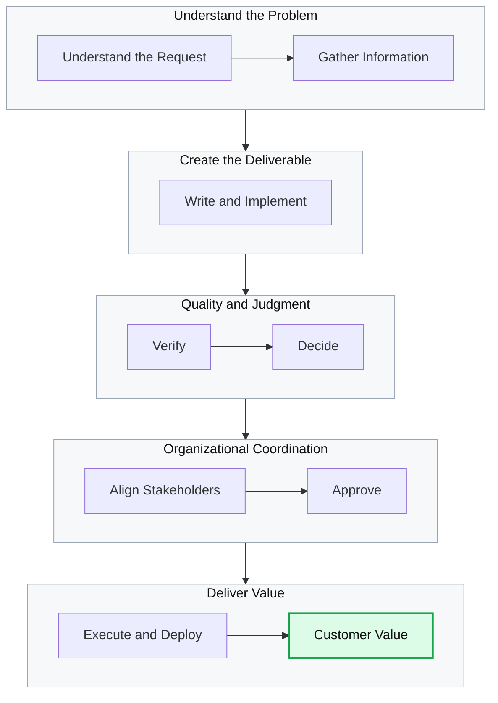
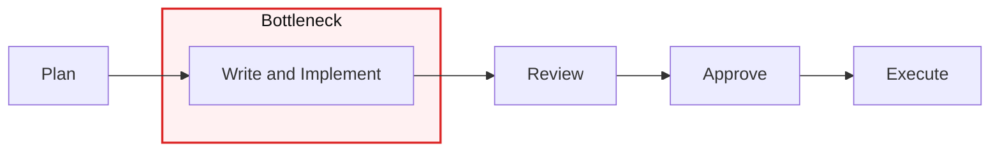
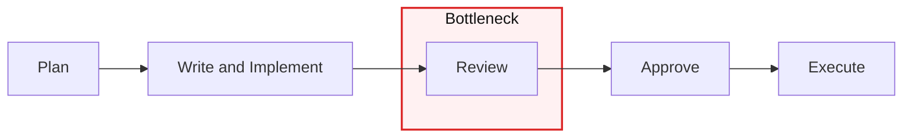

{:style="width:100%"}

AI makes work faster. A document draft appears in minutes, repetitive code is filled in quickly, and meeting notes are organized almost instantly. Yet something feels off. Individuals are clearly moving faster, but project completion dates barely move forward. Decisions still take time, and some people are busier than ever reviewing a growing volume of documents and code.

This is not simply a problem of "AI not being good enough yet." There is a more fundamental issue.

> **AI has lowered the cost of creation, but organizational performance is determined by what happens afterward: verification, judgment, coordination, and execution.**

In other words, the productivity challenge in the AI era is not about producing more. It is about redesigning the flow that turns what we produce into customer value.

This article is for team leaders and practitioners who have adopted AI tools but have yet to see a meaningful change in organizational performance.

## 1. Individuals Got Faster. Why Didn't the Organization?

The first thing AI reduces is the time an individual spends on a task.

- Drafting from a blank page
- Writing repetitive code
- Summarizing and classifying information
- Formatting emails and reports
- Exploring multiple ideas quickly

Research has demonstrated these effects. An NBER study analyzed 5,179 customer support agents using a generative AI assistant. The number of issues resolved per hour increased by 14% on average. The improvement was especially large—34%—among novice and lower-skilled agents, while the impact on experienced agents was small. ([NBER study](https://www.nber.org/papers/w31161))

The takeaway is clear: AI can make people work faster. But the effect varies by task and level of expertise.

More importantly, organizational productivity is not the sum of individual working hours.



If AI only accelerates `writing and implementation`, the whole system will not speed up by the same amount. If the downstream stages remain unchanged, the bottleneck has not disappeared. It has only moved.

Think of a factory. If the packaging machine becomes ten times faster while inspection and shipping remain unchanged, output will not increase tenfold. Packaged goods will simply pile up in front of the inspection station.

In an office, those goods are documents, code, plans, analyses, images, and ideas. The more deliverables AI produces, the more people must read, choose, verify, and agree on.

## 2. AI Did Not Remove the Bottleneck. It Moved It

Before AI, drafting or implementation was often the slow stage.



After adopting AI, writing and implementation become faster. Work then accumulates in front of review and judgment.



So we need to change the question.

> **Was the stage AI accelerated actually the true bottleneck in the overall system?**

If not, a local speed improvement will not translate into final outcomes. The queue at the creation stage gets shorter, while the queues for verification and approval get longer. This is the AI productivity paradox.

## 3. Where Do the New Bottlenecks Appear?

AI output looks finished because its prose sounds natural and its structure is polished. But a plausible format does not guarantee accuracy or feasibility.

An AI-generated report, code change, or proposal is not an outcome. More precisely, it is **a candidate that still needs review**. AI has made it cheap to produce many such candidates.

Having more candidates is useful. But unless the ability to select and verify them grows as well, those candidates become inventory.

### The Quality Bottleneck: Can We Trust It?

AI can be fluent even when it is wrong, which makes review more difficult. Reviewers must separate whether a sentence or a piece of code looks convincing from whether it is actually correct.

```text
"AI organized this. Please check it."
```

That often translates to:

```text
"Verifying its accuracy is now your job."
```

The time saved by the author is transferred to the reviewer.

A similar pattern has been observed in software development. A study of 2,755 open-source projects and 1,699 contributors before and after GitHub Copilot adoption found that code rework increased by 2.4%. Review activity by experienced core contributors increased by 6.5%, while the amount of code they authored fell by 19%. ([Xu et al.](https://arxiv.org/abs/2510.10165))

The interpretation is straightforward. As AI reduces the burden of generation, it can shift the burden of review and maintenance onto experienced people.

### The Context Bottleneck: Does It Fit Our Situation?

AI is strong at general knowledge and common patterns. But it does not know an organization's tacit knowledge well.

- Why a past decision was made
- What a particular customer actually finds frustrating
- Which incidents have happened repeatedly
- Which approaches have already been tried and discarded
- Which undocumented constraints must still be respected

Without this context, AI produces an answer that is plausible on average. It may not be an answer we can use directly in our work. Someone must put the context back in and substantially revise the result.

### The Decision Bottleneck: What Should We Reject?

AI makes it easy to expand the set of options: 20 marketing taglines, 10 feature ideas, or three implementation approaches.

The hard part is choosing. We still need to decide what is good, what to discard, and what to do first. In the AI era, the scarce resource is not ideas but **explicit decision criteria**.

Without clear criteria, more alternatives lead to more meetings and slower decisions.

### The Operational Bottleneck: Can People Keep Up?

Run several AI tasks in parallel and output grows quickly. But there is a limit to how much one person can read deeply and evaluate at the same time.

Writing prompts, comparing results, finding errors, requesting revisions, and explaining the final output all become a new kind of management work. This is why increasing automation can still leave people more exhausted.

A study that tracked 802 developers and 196,212 pull requests at one company for more than two years found a similar pattern. Pull request throughput per developer roughly doubled, but the workload per reviewer also roughly doubled. Merge and revert rates did not change significantly. ([He et al.](https://arxiv.org/abs/2607.01904))

The work did not disappear. It moved downstream.

## 4. What Should Organizations Change?

Changing the tool is not enough. Individual work habits, team operations, and the system used for verification all need to change together.

The 2025 DORA report also treats AI less as a standalone productivity tool and more as an amplifier of an organization's existing capabilities. It explains that turning AI's effects into organizational performance requires foundational capabilities such as clear workflows, internal context, automated testing, and fast feedback. ([2025 DORA report](https://cloud.google.com/blog/products/ai-machine-learning/announcing-the-2025-dora-report))

### The Creator Owns the First Round of Verification

The first thing to change is not a massive automation system. It is how work gets handed off.

A poor handoff looks like this:

```text
This material was prepared with AI. Please review the whole thing.
```

A better handoff looks like this:

```text
I created the draft with AI and verified the following:

- Whether it conflicts with existing policy
- The original sources for key figures
- Whether customer requirements A, B, and C are reflected

I have not yet verified D.
The only decision that needs review is item 2.
```

The difference is significant. The reviewer is no longer rebuilding the entire deliverable. They are evaluating clearly marked issues.

Some of the time saved with AI must be reinvested in self-review. Without this principle, productivity gains merely become someone else's review burden.

### Add Quality Gates

Each type of work may need a different checklist. Even so, the following questions are a useful baseline.

```text
□ Are the purpose and intended audience clear?
□ Is there evidence for every key claim?
□ Have the facts, figures, and links been checked directly?
□ Does it reflect our organization's context and constraints?
□ Are uncertain parts clearly marked?
□ Is the recipient's next action clear?
□ Is the person ultimately accountable clearly identified?
```

A checklist does not mean blindly trusting AI, nor does it mean trusting nothing. It turns the necessary verification into a repeatable process.

### Structure Review Requests

In the AI era, a review request should include at least three things.

- What was created and which parts AI handled
- What a person has verified and what remains uncertain
- What decision the reviewer needs to make

The goal is not to eliminate review. It is to spend the reviewer's time on important judgments instead of basic error hunting.

### Agree on Decision Criteria First

Before asking AI to generate alternatives, decide how those alternatives will be compared.

For feature prioritization, instead of asking whether something "looks good," you might use criteria such as:

- Customer impact
- Implementation cost and operational risk
- Strategic alignment
- Ease of reversal
- Whether success can be measured

With criteria in place, AI becomes more than a tool for generating options. It can organize alternatives against the same standards. A person still makes the final decision, but the cost of preparing for that decision falls.

### Build a Team Context Package

To avoid explaining everything to AI from scratch each time, organize the team's baseline context into a reusable form.

For a development team, it might include:

- Product purpose and primary customers
- System architecture and the responsibility of each module
- Coding, testing, and security standards
- Major past decisions and their rationale
- Known incidents and prohibited patterns
- Code review criteria

For planning or operations teams, it could include customer definitions, key metrics, policies, a glossary, and approval rules.

This documentation is not only for AI. It also helps with onboarding, cross-team collaboration, and consistent decision-making.

### Automate the Checks Machines Do Well

Repeatable checks with unambiguous results should be completed before human review.

In software development, the sequence might look like this:

```text
Formatting checks
→ Type checks
→ Unit tests
→ Security checks
→ Dependency and license checks
→ Change-impact summary
→ Human review
```

For documents, tools can automatically check for missing required sections, broken links, prohibited language, formatting violations, and duplication. In customer support, they can first check for personal information, policy-sensitive responses, and incorrect amount or date formats.

Automated verification does not eliminate human responsibility. It reduces low-value repetitive checks before human judgment is needed.

### Keep Agent Automation Small

Agent automation is not a universal solution. But it works well for repeatable parts of verification, organization, and handoff where success conditions are clear.

For example:

- Extract decisions and action items from meeting notes and draft tickets
- Classify customer inquiries, retrieve relevant policies, and prepare response drafts
- Summarize code changes and flag potential gaps in testing
- Gather operational logs and organize possible causes and the order in which to check them
- Collect data for recurring reports and validate formatting

Good automation is not the automation with the most autonomy. It is automation whose failures are easy to detect and reverse.

```text
Clear input
→ Bounded task
→ Automated checks
→ Human approval based on risk
→ Execution
→ Record of outcomes and revisions
```

If the goal is vague, the result is difficult to verify, and mistakes are costly, full automation from the outset will leave people constantly supervising AI. That is not automation. It is a new kind of management work.

## 5. What Should We Measure?

If AI adoption is measured by usage count, documents generated, or lines of code, the organization rewards producing more. But these are measures of activity, not outcomes.

Organizations should measure the flow of work.

- Did final delivery get faster?
  - Overall lead time and cycle time
- Did the downstream burden decrease?
  - Review wait time and approval time
- Was quality maintained or improved?
  - Rework, error, and incident rates
- Did it create customer value?
  - Resolution, satisfaction, conversion, and retention rates
- Is it sustainable?
  - Interruptions, fatigue, and context switches

The unit of measurement should be the workflow, not the individual. You need to examine both working time and waiting time at each stage to see where the bottleneck has moved.

You should also decide in advance where the time saved by AI will go. If every saved hour is immediately filled with more work, employees will not experience the productivity gain. Output grows, and the bottleneck may only get worse.

Saved time can be reinvested in:

- Customer interviews and problem discovery
- Quality verification and testing
- Important decisions
- Technical debt and documentation
- Sharing team context
- Learning and recovery

Set the goal of AI adoption as "producing more," and production volume will rise. Set it as "improving the flow to completion," and time will be spent removing bottlenecks.

## 6. Try a 30-Day Experiment

Rather than encouraging AI use across the entire organization, choose one recurring workflow and run a small experiment.

### Week 1: Measure the Full Flow and Its Bottleneck

Break the work into request, creation, review, approval, and execution stages. Record both working time and waiting time for each stage. If AI is already in use, observe whose time decreases and whose increases.

### Week 2: Define Standards for What Comes After Creation

Set the definition of done, a self-review checklist, the review-request format, and the approver and accountable owner. Organize the minimum essential context to give AI.

### Week 3: Automate Repetitive Checks

Start with areas where the correct answer is relatively clear: formatting, omissions, policy compliance, and testing. Keep risky actions behind human approval.

### Week 4: Compare End-to-End Results

Instead of counting AI usage, compare the following before and after:

- Total completion time
- Review and approval wait time
- Rework and errors
- Actual utilization of the output
- Fatigue among the people responsible
- Value delivered to the customer or the next team

If there is no improvement, do not start by changing the model or prompt. Revisit where the actual bottleneck lies.

## 7. Recalculating Productivity

If we describe AI's effect only as "writing time fell by a certain percentage," we miss what happens in reality. From an organizational perspective, it is more useful to think of it this way:

```text
Final productivity
= time saved in creation
- cost of providing context
- cost of verification and revision
- cost of review and coordination
- cost of errors and technical debt
- cost of cognitive fatigue
+ better decision quality
+ greater customer value
+ reusable organizational knowledge
```

This formula looks beyond the time saved during creation. It accounts for both the new costs introduced by AI and the final outcomes.

## Conclusion: Fix the Flow Instead of Producing More

AI lowers the cost of creation. That is a real change. But organizational performance is determined by the verification, judgment, coordination, and execution that happen afterward.

Organizations that use AI well do not stop at generating more output. Creators own the first round of verification, teams share decision criteria, and systems handle repetitive checks first.

The competitive advantage in the AI era is not the ability to produce more. It is the ability to turn what we produce into value faster and more safely.
