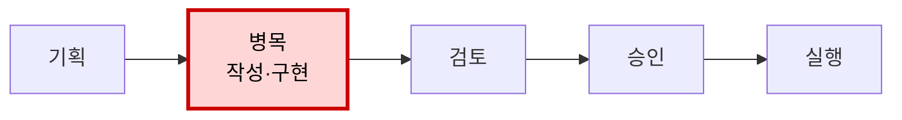
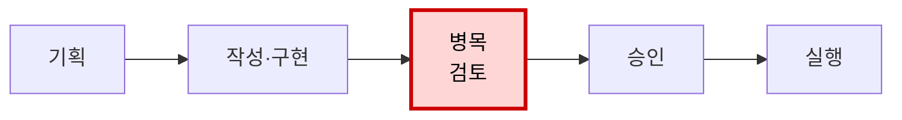

{:style="width:100%"}

AI를 쓰면 일은 빨라집니다. 문서 초안은 몇 분 만에 나오고, 반복 코드는 금방 채워지고, 회의록도 바로 정리됩니다. 그런데 이상합니다. 개인은 분명 빨라졌는데 프로젝트 완료일은 크게 당겨지지 않습니다. 의사결정은 여전히 늦고, 누군가는 예전보다 더 많은 문서와 코드를 검토하느라 바쁩니다.

이건 단순히 "AI가 아직 부족해서" 생기는 문제가 아닙니다. 더 근본적인 문제가 있습니다.

> **AI는 생성 비용을 낮췄지만, 조직의 성과는 생성 이후의 검증·판단·조율·실행에서 결정됩니다.**

즉 AI 시대의 생산성 문제는 더 많이 만드는 문제가 아닙니다. 만들어진 결과물이 고객 가치로 넘어가는 흐름을 다시 설계하는 문제입니다.

이 글은 AI 도구를 도입했지만 조직 성과의 변화를 크게 느끼지 못하는 팀 리더와 실무자를 위한 글입니다.

## 1. 개인은 빨라졌는데 조직은 왜 그대로일까

AI가 먼저 줄이는 것은 개인의 작업 시간입니다.

- 빈 문서에서 초안을 만드는 시간
- 반복 코드를 작성하는 시간
- 자료를 요약하고 분류하는 시간
- 이메일이나 보고서 형식을 갖추는 시간
- 여러 아이디어를 빠르게 펼쳐보는 시간

실제 연구에서도 이런 효과는 보입니다. NBER 연구는 생성형 AI 도우미를 쓴 고객지원 상담원 5,179명을 분석했습니다. 시간당 문제 해결 건수는 평균 14% 늘었습니다. 특히 초보·저숙련 상담원은 34% 개선됐습니다. 반면 숙련자에게 미친 영향은 작았습니다. ([NBER 연구](https://www.nber.org/papers/w31161))

이 결과가 말해주는 것은 분명합니다. AI는 사람의 작업 속도를 올릴 수 있습니다. 다만 효과는 업무 종류와 숙련도에 따라 다릅니다.

그리고 더 중요한 점이 있습니다. 조직의 생산성은 개인 작업 시간의 합이 아닙니다.

```text
요청 이해
→ 자료 수집
→ 작성·구현
→ 검증
→ 판단
→ 이해관계자 조율
→ 승인
→ 실행·배포
→ 고객 가치
```

AI가 이 중 `작성·구현`만 빠르게 만들었다면 전체 속도는 그만큼 빨라지지 않습니다. 뒤 단계가 그대로라면 병목은 사라지지 않습니다. 위치만 바뀝니다.

공장으로 보면 쉽습니다. 포장 기계만 열 배 빨라졌는데 검수와 출고가 그대로라면 출고량이 열 배가 되지 않습니다. 검수대 앞에 포장된 물건이 쌓입니다.

사무실에서는 그 물건이 문서, 코드, 기획안, 분석, 이미지, 아이디어입니다. AI가 산출물을 많이 만들수록 사람이 읽고, 고르고, 확인하고, 합의해야 할 것도 늘어납니다.

## 2. AI가 없앤 것은 병목이 아니라 병목의 위치다

AI 도입 전에는 초안 작성이나 구현이 느린 경우가 많았습니다.



AI 도입 후에는 작성과 구현이 빨라집니다. 대신 검토와 판단 앞에 일이 쌓입니다.



그래서 질문을 바꿔야 합니다.

> **AI가 빠르게 만든 단계가 원래 전체 시스템의 진짜 병목이었는가?**

아니라면 국소적인 속도 향상은 최종 성과로 이어지지 않습니다. 생성 단계의 대기열은 줄지만 검증과 승인 단계의 대기열이 길어집니다. 이것이 AI 생산성의 역설입니다.

## 3. 새 병목은 어디서 생기는가

AI 산출물은 완성품처럼 보입니다. 문장이 자연스럽고 구조도 깔끔하기 때문입니다. 하지만 그럴듯한 형식은 정확성이나 실행 가능성을 보장하지 않습니다.

AI가 만든 보고서, 코드, 기획안은 성과가 아닙니다. 더 정확히 말하면 **검토가 필요한 후보**입니다. 후보를 싸게 많이 만들 수 있게 된 것입니다.

후보가 많아지는 것은 좋은 일입니다. 하지만 고르고 검증하는 능력이 같이 늘지 않으면 후보는 재고가 됩니다.

### 품질 병목: 믿을 수 있는가

AI 결과물은 틀릴 때도 매끄럽습니다. 그래서 더 까다롭습니다. 검토자는 문장이나 코드가 그럴듯하다는 사실과 내용이 맞다는 사실을 분리해서 봐야 합니다.

```text
"AI가 정리했습니다. 확인 부탁드립니다."
```

이 말은 종종 이렇게 번역됩니다.

```text
"정확성 확인은 이제 당신의 일입니다."
```

작성자가 아낀 시간이 검토자의 일로 넘어가는 셈입니다.

소프트웨어 개발에서도 비슷한 현상이 보입니다. GitHub Copilot 도입 전후의 오픈소스 프로젝트 2,755개와 기여자 1,699명을 분석한 연구에서는 코드 재작업이 2.4% 늘었습니다. 숙련된 핵심 기여자의 리뷰 활동은 6.5% 늘었고, 이들이 직접 작성한 코드 생산량은 19% 줄었습니다. ([Xu 외 연구](https://arxiv.org/abs/2510.10165))

해석은 단순합니다. AI가 생성 부담을 줄이는 동안, 검토와 유지보수 부담은 숙련자에게 옮겨갈 수 있습니다.

### 맥락 병목: 우리 상황에 맞는가

AI는 일반 지식과 전형적인 패턴에는 강합니다. 하지만 조직의 암묵지는 잘 모릅니다.

- 과거에 왜 그 결정을 내렸는지
- 특정 고객이 실제로 불편해하는 지점이 무엇인지
- 어떤 장애가 반복되었는지
- 이미 시도했다가 버린 방법은 무엇인지
- 문서에는 없지만 반드시 지켜야 하는 조건은 무엇인지

이 맥락이 빠지면 AI는 평균적으로 그럴듯한 답을 냅니다. 하지만 바로 우리 일에 쓸 수 있는 답은 아닐 수 있습니다. 결국 사람이 맥락을 다시 넣고 크게 고쳐야 합니다.

### 의사결정 병목: 무엇을 버릴 것인가

AI는 선택지를 쉽게 늘립니다. 마케팅 문구 20개, 기능 아이디어 10개, 구현 방식 3개를 만드는 일은 어렵지 않습니다.

문제는 선택입니다. 무엇이 좋은지, 무엇을 버릴지, 지금 무엇부터 할지 결정해야 합니다. AI 시대에 부족해지는 것은 아이디어가 아니라 **명시적인 판단 기준**입니다.

기준이 없으면 대안이 많아질수록 회의가 늘고 결정은 늦어집니다.

### 운영 병목: 사람이 감당할 수 있는가

여러 AI 작업을 동시에 돌리면 산출량은 빠르게 늘어납니다. 하지만 한 사람이 동시에 깊게 읽고 판단할 수 있는 양에는 한계가 있습니다.

프롬프트를 쓰고, 결과를 비교하고, 오류를 찾고, 다시 요청하고, 최종 결과를 설명하는 과정은 새로운 관리 업무가 됩니다. 자동화를 늘렸는데도 더 피곤해지는 이유가 여기에 있습니다.

한 기업의 개발자 802명과 풀 리퀘스트 196,212개를 2년 이상 추적한 연구도 비슷한 흐름을 보여줍니다. 개발자당 풀 리퀘스트 처리량은 약 2배로 늘었지만, 리뷰어 한 명이 맡는 부하도 약 2배로 늘었습니다. 병합률과 되돌림 비율은 크게 달라지지 않았습니다. ([He 외 연구](https://arxiv.org/abs/2607.01904))

작업은 줄어든 것이 아니라 뒤 단계로 이동했습니다.

## 4. 조직은 무엇을 바꿔야 할까

도구만 바꿔서는 부족합니다. 개인의 작업 습관, 팀의 운영 방식, 시스템의 검증 구조가 함께 바뀌어야 합니다.

2025년 DORA 보고서도 AI를 독립적인 생산성 도구라기보다 조직의 기존 역량을 증폭하는 요소로 봅니다. AI의 효과를 조직 성과로 연결하려면 명확한 업무 흐름, 내부 맥락, 자동 테스트, 빠른 피드백 같은 기반 역량이 필요하다고 설명합니다. ([2025 DORA 보고서](https://cloud.google.com/blog/products/ai-machine-learning/announcing-the-2025-dora-report))

### 생성한 사람이 1차 검증까지 맡는다

가장 먼저 바꿀 것은 거대한 자동화 시스템이 아닙니다. 전달 방식입니다.

나쁜 전달은 이렇습니다.

```text
AI가 정리한 자료입니다. 전체적으로 검토해 주세요.
```

좋은 전달은 이렇습니다.

```text
AI로 초안을 만들고 제가 다음 내용을 확인했습니다.

- 기존 정책과의 충돌 여부
- 핵심 수치의 원출처
- 고객 요구사항 A·B·C의 반영 여부

아직 확인하지 못한 부분은 D입니다.
검토가 필요한 결정은 2번 항목 하나입니다.
```

차이는 큽니다. 리뷰어가 결과물 전체를 다시 만드는 사람이 아니라, 표시된 쟁점을 판단하는 사람이 됩니다.

AI를 써서 아낀 시간의 일부는 반드시 자체 검증에 다시 써야 합니다. 이 원칙이 없으면 생산성 향상은 누군가의 검토 부담으로 이전됩니다.

### 품질 게이트를 둔다

업무마다 체크리스트는 달라질 수 있습니다. 그래도 최소한 아래 질문은 공통으로 쓸 수 있습니다.

```text
□ 목적과 대상 독자가 분명한가?
□ 핵심 주장에 근거가 있는가?
□ 사실·수치·링크를 직접 확인했는가?
□ 우리 조직의 맥락과 제약을 반영했는가?
□ 불확실한 부분을 표시했는가?
□ 받는 사람이 해야 할 다음 행동이 명확한가?
□ 최종 책임자가 누구인지 분명한가?
```

체크리스트는 AI를 무조건 믿자는 말도, 아무것도 믿지 말자는 말도 아닙니다. 필요한 검증을 반복 가능한 절차로 바꾸자는 말입니다.

### 리뷰 요청을 구조화한다

AI 시대의 리뷰 요청에는 최소한 세 가지가 들어가야 합니다.

- 만든 결과와 AI가 담당한 범위
- 사람이 확인한 내용과 아직 불확실한 부분
- 리뷰어가 내려야 할 결정

목표는 리뷰를 없애는 것이 아닙니다. 리뷰어의 시간을 오류 찾기보다 중요한 판단에 쓰게 만드는 것입니다.

### 판단 기준을 먼저 합의한다

AI에게 대안을 만들게 하기 전에 무엇으로 비교할지 정해야 합니다.

기능 우선순위를 정한다면 "좋아 보이는가"가 아니라 이런 기준을 쓸 수 있습니다.

- 고객에게 미치는 영향
- 구현 비용과 운영 위험
- 전략과의 정합성
- 되돌리기 쉬운지
- 성공 여부를 측정할 수 있는지

기준이 있으면 AI는 대안을 늘리는 도구를 넘어 같은 기준으로 대안을 정리하는 도구가 됩니다. 최종 판단은 사람이 하지만 판단 준비 비용은 줄어듭니다.

### 팀의 컨텍스트 패키지를 만든다

AI에게 매번 처음부터 설명하지 않으려면 팀의 기본 맥락을 재사용 가능한 형태로 정리해야 합니다.

개발팀이라면 이런 내용이 들어갈 수 있습니다.

- 제품 목적과 주요 고객
- 시스템 구조와 모듈별 책임
- 코딩·테스트·보안 기준
- 과거 주요 결정과 그 이유
- 알려진 장애와 금지 패턴
- 코드 리뷰 기준

기획이나 운영팀이라면 고객 정의, 핵심 지표, 정책, 용어집, 승인 규칙을 담을 수 있습니다.

이 문서는 AI만을 위한 문서가 아닙니다. 신입 온보딩, 팀 간 협업, 의사결정 일관성에도 도움이 됩니다.

### 기계가 잘하는 검사는 먼저 자동화한다

반복 가능하고 결과가 명확한 검사는 사람 리뷰 전에 끝내는 편이 좋습니다.

개발에서는 이런 순서가 가능합니다.

```text
형식 검사
→ 타입 검사
→ 단위 테스트
→ 보안 검사
→ 의존성·라이선스 검사
→ 변경 영향 요약
→ 사람 리뷰
```

문서에서는 필수 항목 누락, 링크 유효성, 금지 표현, 형식 위반, 중복을 자동으로 확인할 수 있습니다. 고객지원에서는 개인정보 포함 여부, 정책상 위험한 답변, 금액과 날짜 형식을 먼저 검사할 수 있습니다.

자동 검증은 사람의 책임을 없애지 않습니다. 사람이 판단할 가치가 낮은 반복 검사를 앞에서 줄입니다.

### 에이전트 자동화는 작게 쓴다

에이전트 자동화는 만능키가 아닙니다. 하지만 검증·정리·전달 과정 중 반복 가능하고 성공 조건이 분명한 부분에는 잘 맞습니다.

예를 들면 이런 일입니다.

- 회의록에서 결정사항과 할 일을 추출해 티켓 초안을 만든다
- 고객 문의를 분류하고 관련 정책을 찾아 답변 초안을 준비한다
- 코드 변경 내용을 요약하고 테스트 누락 후보를 표시한다
- 운영 로그를 모아 원인 후보와 확인 순서를 정리한다
- 정기 보고서에 필요한 데이터를 모으고 형식 오류를 검사한다

좋은 자동화는 자율성이 가장 높은 자동화가 아닙니다. 실패를 발견하고 되돌리기 쉬운 자동화입니다.

```text
명확한 입력
→ 제한된 작업
→ 자동 검사
→ 위험도에 따른 사람 승인
→ 실행
→ 결과와 수정 이력 기록
```

목표가 모호하고, 결과 검증이 어렵고, 실수 비용이 큰 일을 처음부터 완전 자동화하면 사람은 AI를 계속 감시하게 됩니다. 그러면 자동화가 아니라 새로운 관리 업무입니다.

## 5. 무엇을 측정해야 할까

AI 도입 효과를 사용 횟수, 생성한 문서 수, 코드 줄 수로 측정하면 더 많이 만드는 행동이 보상됩니다. 하지만 이것들은 성과가 아니라 활동량입니다.

조직이 봐야 할 것은 업무 흐름입니다.

- 최종 전달이 빨라졌는가?
  - 전체 리드타임, 사이클타임
- 뒤 단계의 부담이 줄었는가?
  - 리뷰 대기 시간, 승인 시간
- 품질이 유지되거나 좋아졌는가?
  - 재작업률, 오류율, 장애율
- 고객에게 가치가 생겼는가?
  - 해결률, 만족도, 전환율, 유지율
- 지속 가능한가?
  - 집중 방해 횟수, 피로도, 업무 전환 횟수

측정 단위는 개인이 아니라 업무 흐름이어야 합니다. 단계별 작업 시간과 대기 시간을 함께 봐야 병목이 어디로 이동했는지 알 수 있습니다.

그리고 AI가 절약한 시간을 어디에 쓸지도 미리 정해야 합니다. 절약된 시간을 곧바로 더 많은 업무로 채우면 구성원은 생산성 향상을 체감하지 못합니다. 산출량만 늘고 병목은 더 심해질 수 있습니다.

절약된 시간은 이런 곳에 재투자할 수 있습니다.

- 고객 인터뷰와 문제 이해
- 품질 검증과 테스트
- 중요한 의사결정
- 기술 부채와 문서 정리
- 팀의 맥락 공유
- 학습과 회복

AI 도입의 목적을 "더 많이 만들기"로 잡으면 생성량이 늘어납니다. "완료까지의 흐름 개선"으로 잡으면 병목 제거에 시간이 쓰입니다.

## 6. 30일만 실험해보자

조직 전체에 AI 사용을 장려하기보다 하나의 반복 업무 흐름을 골라 작게 실험하는 편이 낫습니다.

### 1주차: 전체 흐름과 병목을 잰다

업무를 요청, 작성, 검토, 승인, 실행 단계로 나눕니다. 각 단계의 작업 시간과 대기 시간을 기록합니다. AI가 이미 쓰이고 있다면 누구의 시간이 줄고 누구의 시간이 늘었는지도 봅니다.

### 2주차: 생성 이후의 기준을 만든다

완료 조건, 자체 검증 체크리스트, 리뷰 요청 형식, 승인자와 책임자를 정합니다. AI에 제공할 핵심 맥락도 최소한으로 정리합니다.

### 3주차: 반복 검사를 자동화한다

형식, 누락, 정책, 테스트처럼 정답이 비교적 분명한 항목부터 자동화합니다. 위험한 실행은 사람 승인 뒤에 둡니다.

### 4주차: 전체 성과를 비교한다

AI 사용 횟수가 아니라 다음을 전후 비교합니다.

- 전체 완료 시간
- 검토와 승인 대기 시간
- 재작업과 오류
- 결과물의 실제 사용률
- 담당자의 피로도
- 고객 또는 다음 팀이 얻은 가치

개선이 없다면 모델이나 프롬프트부터 바꾸지 말고 병목이 실제로 어디에 있는지 다시 봐야 합니다.

## 7. 생산성을 다시 계산하면

AI의 효과를 "작성 시간이 몇 퍼센트 줄었다"로만 표현하면 현실을 놓칩니다. 조직 관점에서는 이렇게 보는 편이 낫습니다.

```text
최종 생산성
= 생성 시간 절감
- 맥락 제공 비용
- 검증·수정 비용
- 리뷰·조율 비용
- 오류와 기술 부채 비용
- 인지 피로 비용
+ 의사결정 품질 향상
+ 고객 가치 증가
+ 재사용 가능한 조직 지식
```

이 계산식은 생성 시간 절감만 보지 않습니다. AI 사용으로 새로 생긴 비용과 최종 결과를 함께 보게 합니다.

## 맺으며: 더 많이 만드는 것보다 흐름을 고치는 것

AI는 생성 비용을 낮춥니다. 이건 분명한 변화입니다. 하지만 조직의 성과는 생성 이후의 검증·판단·조율·실행에서 결정됩니다.

그래서 AI를 잘 쓰는 조직은 산출물을 많이 만드는 데서 멈추지 않습니다. 생성자는 1차 검증을 맡고, 팀은 판단 기준을 공유하며, 시스템은 반복 검사를 먼저 처리합니다.

AI 시대의 경쟁력은 더 많이 만드는 능력이 아닙니다. 만들어진 것을 더 빠르고 안전하게 가치로 전환하는 능력입니다.
