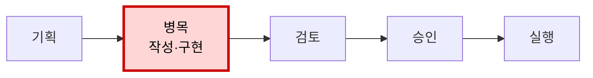
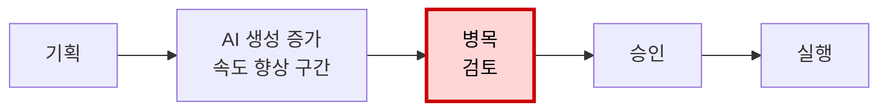

{:style="width:100%"}

ChatGPT로 문서 초안을 만들고, 코딩 도구로 반복 코드를 작성하고, 회의 내용을 몇 초 만에 요약합니다. 분명 예전보다 빠릅니다. 그런데 이상합니다. 개인은 빨라졌다고 느끼는데 프로젝트 완료일은 크게 당겨지지 않고, 의사결정은 여전히 늦으며, 누군가는 더 많은 문서와 코드를 검토하느라 바쁩니다.

이 현상을 단순히 “AI가 아직 부족해서”라고 설명하면 중요한 부분을 놓칩니다. AI의 성능이 좋아져도 조직의 최종 생산성이 자동으로 오르지는 않습니다. 개인이 한 작업을 빠르게 끝내는 것과, 조직이 고객에게 더 나은 결과를 더 빨리 전달하는 것은 서로 다른 문제이기 때문입니다.

이 글의 핵심 주장은 다음과 같습니다.

> **AI는 생성 비용을 크게 낮췄지만, 조직의 최종 성과는 생성 이후의 검증·판단·조율·실행에서 결정됩니다. 따라서 AI 시대의 생산성 문제는 더 많이 만드는 것이 아니라, 만들어진 결과물이 가치로 전환되는 흐름을 다시 설계하는 문제입니다.**

이 글은 AI 도구를 도입했지만 프로젝트 완료 속도나 조직 성과의 변화를 체감하지 못하는 팀 리더와 실무자를 위한 글입니다.

## 1. 왜 역설이 생기는가

### 개인 생산성과 조직 생산성은 같은 말이 아니다

AI가 먼저 개선하는 것은 대개 개인의 **작업 속도**입니다.

- 빈 문서에서 초안을 만드는 시간
- 반복 코드를 작성하는 시간
- 자료를 요약하고 분류하는 시간
- 이메일이나 보고서의 형식을 갖추는 시간
- 여러 아이디어를 빠르게 펼쳐보는 시간

이 변화는 실제 현장에서도 관찰됩니다. NBER 연구에서는 생성형 AI 도우미를 사용한 고객지원 상담원 5,179명의 시간당 문제 해결 건수가 평균 14% 증가했습니다. 다만 초보·저숙련 상담원은 34% 개선된 반면 숙련자에게 미친 영향은 작았습니다. AI의 효과는 업무와 사용자의 숙련도에 따라 다르게 나타났습니다. ([NBER 연구](https://www.nber.org/papers/w31161))

그러나 조직의 생산성은 개인 작업 시간의 단순한 합이 아닙니다. 조직의 결과물은 여러 단계를 거쳐야 비로소 가치가 됩니다.

```text
요청 이해
→ 자료 수집
→ 작성·구현
→ 검증
→ 판단
→ 이해관계자 조율
→ 승인
→ 실행·배포
→ 고객 가치
```

AI가 이 가운데 `작성·구현` 단계만 크게 단축했다면 전체 소요 시간은 그만큼 줄지 않을 수 있습니다. 뒤 단계가 더 느리거나, AI로 인해 검토할 산출물이 급증한다면 오히려 전체 흐름은 더 막힐 수도 있습니다.

생산 라인을 떠올리면 이해하기 쉽습니다. 포장 기계만 열 배 빨라졌는데 검수 인력과 출고 설비가 그대로라면, 공장 전체의 출고량이 열 배가 되지는 않습니다. 검수대 앞에 포장된 물건이 쌓일 뿐입니다.

사무실에서는 문서, 코드, 기획안, 분석, 이미지, 아이디어가 검수대 앞의 재고처럼 쌓입니다. 이를 읽고, 신뢰성을 확인하고, 선택하고, 합의하는 인간의 처리 능력은 같은 속도로 늘지 않기 때문입니다.

### AI가 없앤 것은 병목이 아니라 병목의 위치다

AI 도입 전에는 초안을 만들거나 구현하는 과정이 느렸습니다.



AI 도입 후에는 생성이 빨라지고 산출량이 늘어납니다.



여기서 중요한 것은 “AI가 생산성을 올렸는가, 올리지 못했는가”라는 이분법이 아닙니다. 더 정확한 질문은 이것입니다.

> **AI가 빠르게 만든 단계가 원래 전체 시스템의 진짜 병목이었는가?**

아니라면 국소적인 속도 향상은 최종 성과로 이어지지 않습니다. 생성 단계의 대기열은 줄지만, 검증과 승인 단계의 대기열이 길어집니다. 이것이 AI 생산성의 역설입니다.

## 2. 병목은 어디로 이동하는가

### 산출물은 성과가 아니라 ‘검토가 필요한 후보’다

AI가 만든 보고서, 코드, 기획안은 완성품처럼 보이기 쉽습니다. 문장은 자연스럽고 구조도 정돈되어 있기 때문입니다. 하지만 그럴듯한 형식은 정확성이나 실행 가능성을 보장하지 않습니다.

AI 산출물이 실제 성과가 되려면 적어도 세 가지 질문을 통과해야 합니다.

- 내용이 정확하고 근거를 확인할 수 있는가?
- 우리 조직의 맥락과 제약에 맞는가?
- 실행할 수 있으며 책임자가 분명한가?

따라서 AI 산출물을 곧바로 성과로 계산하면 안 됩니다. 더 적절한 표현은 "**검토가 필요한 후보의 생성 비용이 낮아졌다**"에 가깝습니다.

후보를 많이 만드는 능력은 유용합니다. 다만 선택하고 검증하는 능력이 함께 개선되지 않으면 후보의 증가는 생산성이 아니라 재고의 증가가 됩니다.

생성 이후의 병목은 크게 **품질**, **의사결정**, **운영**의 세 영역으로 나눌 수 있습니다.

### 품질 병목: 결과를 믿을 수 있는가

**검증 비용이 늘어납니다.**

AI 결과물은 틀릴 때도 매끄럽습니다. 명백히 엉성한 결과보다 더 까다로운 이유입니다. 검토자는 문장이나 코드가 그럴듯하다는 사실과 내용이 맞다는 사실을 분리해서 판단해야 합니다.

```text
"AI가 정리했습니다. 확인 부탁드립니다."
```

이 한 문장은 때때로 “정확성 확인은 이제 당신의 일입니다”라는 뜻이 됩니다. 작성자가 절약한 시간이 검토자의 추가 업무로 이전되는 것입니다.

이러한 부담 이동은 소프트웨어 개발 현장에서도 관찰되었습니다. GitHub Copilot 도입 전후의 오픈소스 프로젝트 2,755개와 기여자 1,699명을 분석한 준실험 연구에서는 코드 재작업이 2.4% 증가했습니다. 숙련된 핵심 기여자의 리뷰 활동은 6.5% 늘어난 반면, 이들이 직접 작성한 코드 생산량은 19% 감소했습니다. 생성 단계의 향상이 검토와 유지보수 업무를 맡은 사람의 부담으로 이어질 수 있음을 보여줍니다. ([Xu 외 연구](https://arxiv.org/abs/2510.10165))

**조직의 맥락이 빠질 수 있습니다.**

AI는 일반 지식과 전형적인 패턴에는 강하지만, 조직의 암묵지는 충분히 알지 못합니다.

- 과거에 왜 그 결정을 내렸는지
- 특정 고객이 실제로 불편해하는 지점이 무엇인지
- 어떤 장애가 반복되었는지
- 어떤 접근을 이미 시도하고 포기했는지
- 문서에 적히지 않은 금지 조건이 무엇인지

이런 맥락이 빠지면 AI는 평균적으로 그럴듯한 답을 내지만, 바로 우리 상황에는 맞지 않는 답을 만들 수 있습니다. 결국 사람이 맥락을 다시 주입하고 결과물을 크게 수정해야 합니다.

**책임이 모호해질 수 있습니다.**

AI가 만든 결과를 누가 승인했고 어느 부분을 검증했는지가 불분명하면 두 가지 극단이 나타납니다.

1. “AI가 그렇게 답했다”며 무비판적으로 수용합니다.
2. “AI 결과는 믿을 수 없다”며 모든 것을 처음부터 다시 확인합니다.

둘 다 비효율적입니다. AI가 관여했더라도 업무의 소유자와 최종 판단자는 명확해야 합니다.

### 의사결정 병목: 무엇을 선택하고 누가 결정하는가

**선택지가 늘수록 판단이 어려워집니다.**

AI는 짧은 시간에 여러 대안을 제시합니다. 마케팅 문구 20개, 기능 아이디어 10개, 구현 방식 3개를 만드는 일은 어렵지 않습니다. 하지만 무엇이 가장 좋은지, 무엇을 버려야 하는지, 지금 무엇을 해야 하는지는 여전히 사람이 결정해야 합니다.

AI 시대에 부족해지는 것은 아이디어가 아니라 **명시적인 판단 기준**입니다. 기준이 없으면 대안의 증가는 선택 피로와 회의 시간을 늘립니다.

**실행하려면 사람과 조직을 조율해야 합니다.**

좋은 결과물도 조직 안에서 합의되고 실행되지 않으면 가치가 없습니다.

- 누가 결정하고 어느 팀이 실행할 것인가?
- 기존 우선순위와 충돌하지 않는가?
- 위험을 누가 부담하는가?
- 다른 부서가 알아야 할 변화는 무엇인가?

AI는 문서와 선택지를 만들 수 있지만 조직의 권한, 신뢰, 이해관계를 저절로 정리해 주지는 않습니다. 산출물이 늘어나면 조율해야 할 안건도 함께 늘 수 있습니다.

### 운영 병목: 늘어난 산출물을 감당할 수 있는가

**인간의 깊은 판단은 AI처럼 병렬화되지 않습니다.**

여러 AI 작업을 동시에 돌리면 산출량은 빠르게 늘어납니다. 그러나 한 사람이 동시에 깊게 읽고 판단할 수 있는 양에는 한계가 있습니다.

프롬프트를 쓰고, 여러 결과를 비교하고, 오류를 찾고, 다시 요청하고, 최종 결과를 설명하는 과정은 새로운 형태의 관리 업무를 만듭니다. 자동화를 늘렸는데도 더 피곤해지는 이유가 여기에 있습니다.

산출량 증가가 리뷰 처리 용량을 압박한 사례도 있습니다. 한 기업의 개발자 802명과 PR 196,212개를 2년 이상 추적한 연구에서는 개발자당 PR 처리량이 약 2배로 증가하는 동안 리뷰어 한 명이 담당하는 부하도 약 2배로 늘었습니다. 자동 리뷰가 사람 리뷰보다 많아졌고, 병합률과 되돌림 비율은 큰 변화 없이 유지되었습니다. 연구진은 이를 AI가 작업을 없애기보다 개발 과정의 뒤 단계로 이동시킨 결과로 해석합니다. ([He 외 연구](https://arxiv.org/abs/2607.01904))

**활동량을 성과로 착각하기 쉽습니다.**

AI 도입 효과를 사용 횟수, 생성한 문서 수, 코드 줄 수로 측정하면 더 많은 산출물을 만드는 행동이 보상됩니다. 그러나 이것들은 성과가 아니라 활동량입니다.

조직이 실제로 봐야 할 것은 다음과 같은 결과 지표입니다.

- 요청부터 완료까지 걸린 전체 시간
- 리뷰와 승인 대기 시간
- 재작업률과 오류율
- 배포 후 되돌림이나 장애
- 의사결정까지 걸린 시간
- 고객 만족, 전환, 유지율 또는 비용 절감
- 구성원의 인지 부담과 지속 가능성

잘못된 측정은 잘못된 최적화를 만듭니다. “AI를 얼마나 많이 썼는가”를 묻는 조직에서는 AI 산출물이 늘고, “고객에게 무엇이 더 빨리 전달되었는가”를 묻는 조직에서는 전체 흐름이 개선됩니다.

## 3. 조직은 무엇을 바꿔야 하는가

병목은 하나의 도구로 해결되지 않습니다. 개인의 작업 습관, 팀의 운영 방식, 시스템의 검증 구조가 함께 바뀌어야 합니다.

약 5,000명의 기술 종사자를 조사한 2025년 DORA 보고서도 AI를 독립적인 생산성 도구보다 조직의 기존 역량을 증폭하는 요소로 설명합니다. 보고서는 AI의 효과를 조직 성과로 연결하려면 명확한 업무 흐름, 내부 맥락, 견고한 자동 테스트와 빠른 피드백 같은 기반 역량이 필요하다고 강조합니다. ([2025 DORA 보고서](https://cloud.google.com/blog/products/ai-machine-learning/announcing-the-2025-dora-report))

**출발점은 생성한 사람이 검증 책임도 갖는 것입니다.**

가장 먼저 바꿔야 할 것은 거대한 자동화 시스템이 아니라 전달 방식입니다. AI로 생성한 사람이 1차 검증과 맥락화를 마친 뒤 전달해야 합니다.

나쁜 전달 방식은 이렇습니다.

```text
AI가 정리한 자료입니다. 전체적으로 검토해 주세요.
```

더 나은 전달은 이렇습니다.

```text
AI로 초안을 만들고 제가 다음 내용을 확인했습니다.

- 기존 정책과의 충돌 여부
- 핵심 수치의 원출처
- 고객 요구사항 A·B·C의 반영 여부

아직 확인되지 않은 부분은 D입니다.
검토가 필요한 결정은 2번 항목 하나입니다.
```

이 차이는 작아 보이지만 중요합니다. 리뷰어가 결과물 전체를 다시 만드는 사람이 아니라, 명확히 표시된 핵심 쟁점을 판단하는 사람이 되기 때문입니다.

따라서 AI를 사용해 절약한 시간의 일부는 반드시 **자체 검증**에 재투자해야 합니다.

### 신뢰할 수 있는 결과를 만든다

#### AI 산출물에 품질 게이트를 둔다

업무 종류에 따라 체크리스트는 달라지지만, 최소한 다음 항목은 공통으로 사용할 수 있습니다.

```text
□ 목적과 대상 독자가 분명한가?
□ 핵심 주장에 근거가 있는가?
□ 사실·수치·링크를 직접 확인했는가?
□ 우리 조직의 맥락과 제약을 반영했는가?
□ 불확실한 부분을 표시했는가?
□ 받는 사람이 해야 할 다음 행동이 명확한가?
□ 최종 책임자가 누구인지 분명한가?
```

체크리스트는 AI가 완벽하다는 가정도, 아무것도 믿을 수 없다는 가정도 하지 않습니다. 필요한 검증을 반복 가능한 절차로 바꿉니다.

#### 리뷰를 ‘전체 검사’에서 ‘핵심 판단’으로 바꾼다

기존 리뷰는 완성된 결과물을 넘기고 리뷰어가 처음부터 끝까지 문제를 찾는 방식이 많았습니다. AI 시대에는 리뷰 요청 자체가 구조화되어야 합니다.

리뷰 요청에는 다음 정보가 포함되어야 합니다.

- 만든 결과와 AI가 담당한 범위
- 사람이 확인한 내용과 아직 불확실한 부분
- 리뷰어가 내려야 할 결정

목표는 리뷰를 없애는 것이 아닙니다. 리뷰어의 시간을 오류 탐색보다 가치 있는 판단에 집중시키는 것입니다.

### 판단과 조율의 기준을 세운다

#### 판단 기준을 먼저 합의한다

AI에게 여러 대안을 만들게 하기 전에 무엇으로 비교할지 정해야 합니다.

예를 들어 기능 우선순위를 정한다면 “좋아 보이는가”가 아니라 다음 기준을 사용할 수 있습니다.

- 고객에게 미치는 영향
- 구현 비용과 운영 위험
- 전략과의 정합성
- 되돌리기 쉬운지와 성공 여부를 측정할 수 있는지

명시적인 기준이 있으면 AI는 대안을 늘리는 도구를 넘어, 동일한 기준으로 대안을 정리하는 도구가 됩니다. 최종 판단은 사람이 하더라도 판단 준비 비용을 줄일 수 있습니다.

#### 조율 구조를 명확히 한다

많은 지연은 결과물의 품질보다 권한과 책임의 모호함에서 생깁니다.

- 업무 소유자와 최종 결정자를 명확히 지정합니다.
- 승인 단계와 각 단계의 통과 기준을 줄이고 명시합니다.
- 중요한 결정은 이유와 함께 기록합니다.
- 다른 팀으로 넘길 때 완료 조건과 예외를 함께 전달합니다.

AI를 도입하기 전에 이런 운영 구조를 정리하면 자동화할 대상도 더 선명해집니다.

#### 팀의 컨텍스트 패키지를 만든다

AI에게 매번 처음부터 설명하지 않으려면 업무에 필요한 기본 맥락을 재사용 가능한 형태로 정리해야 합니다.

개발팀이라면 다음이 포함될 수 있습니다.

- 제품 목적과 주요 고객
- 시스템 구조와 모듈별 책임
- 코딩·테스트·보안 기준
- 과거 주요 결정과 그 이유
- 알려진 장애와 금지 패턴
- 코드 리뷰 기준

기획이나 운영팀이라면 고객 정의, 핵심 지표, 정책, 용어집, 과거 결정, 승인 규칙을 담을 수 있습니다.

컨텍스트 패키지는 AI만을 위한 문서가 아닙니다. 신입 구성원의 온보딩, 팀 간 협업, 의사결정 일관성에도 도움이 되는 조직 자산입니다.

### 반복 작업을 자동화하고 흐름을 관리한다

#### 기계가 잘 검증하는 것은 사람보다 먼저 검사한다

반복 가능하고 결과가 명확한 검사는 자동화하는 편이 좋습니다.

개발에서는 다음과 같은 절차를 사람 리뷰 전에 실행할 수 있습니다.

```text
형식 검사
→ 타입 검사
→ 단위 테스트
→ 보안 검사
→ 의존성·라이선스 검사
→ 변경 영향 요약
→ 사람 리뷰
```

문서에서는 필수 항목 누락, 링크 유효성, 금지 표현, 형식 위반, 중복을 자동으로 확인할 수 있습니다. 고객지원에서는 개인정보 포함 여부, 정책상 위험한 답변, 금액과 날짜 형식을 먼저 검사할 수 있습니다.

자동 검증의 역할은 사람의 책임을 없애는 것이 아니라, 사람이 판단할 가치가 낮은 반복 검사를 앞에서 제거하는 것입니다.

#### Loop·Agent 자동화는 반복 가능한 부분에 제한적으로 쓴다

Loop나 Agent 자동화는 이 문제의 중심도, 유일한 답도 아닙니다. 다만 검증·정리·전달 과정 가운데 **반복 가능하고 성공 조건이 분명한 부분**을 줄이는 데 사용할 수 있습니다.

예를 들면 다음과 같습니다.

- 회의록에서 결정사항과 할 일을 추출하고 티켓 초안을 만듭니다.
- 고객 문의를 분류하고 관련 정책을 찾아 답변 초안을 준비합니다.
- 코드 변경 내용을 요약하고 테스트 누락 후보를 표시합니다.
- 운영 로그를 모아 원인 후보와 확인 순서를 정리합니다.
- 정기 보고서에 필요한 데이터를 모으고 형식 오류를 검사합니다.

좋은 자동화는 자율성이 가장 높은 자동화가 아니라, **실패를 발견하고 되돌리기 쉬운 자동화**입니다.

```text
명확한 입력
→ 제한된 작업
→ 자동 검사
→ 위험도에 따른 사람 승인
→ 실행
→ 결과와 수정 이력 기록
```

반대로 목표가 모호하고, 결과 검증이 어렵고, 실수 비용이 큰 업무를 처음부터 완전 자동화하면 사람은 결국 AI를 계속 감시하는 역할을 맡게 됩니다. 자동화가 새로운 관리 업무가 되는 순간, 도입 목적을 다시 봐야 합니다.

#### AI 사용량이 아니라 전체 흐름을 측정한다

AI 도입 전후를 비교할 때는 개인이 초안을 만드는 데 걸린 시간만 재면 안 됩니다. 요청이 시작된 순간부터 고객이나 다음 팀에 전달될 때까지의 전체 시간을 봐야 합니다.

| 확인할 질문                   | 예시 지표                              |
| ----------------------------- | -------------------------------------- |
| 최종 전달이 빨라졌는가?       | 전체 리드타임, 사이클타임              |
| 뒤 단계의 부담이 줄었는가?    | 리뷰 대기 시간, 승인 시간              |
| 품질이 유지되거나 좋아졌는가? | 재작업률, 오류율, 장애율               |
| 고객에게 가치가 생겼는가?     | 해결률, 만족도, 전환율, 유지율         |
| 지속 가능한가?                | 집중 방해 횟수, 피로도, 업무 전환 횟수 |

측정 단위는 개인이 아니라 **업무 흐름**이어야 합니다. 단계별 작업 시간과 대기 시간을 함께 측정해야 병목이 어디로 이동했는지 알 수 있습니다.

#### 절약된 시간을 어디에 쓸지 미리 정한다

AI가 시간을 절약해도 조직이 즉시 더 많은 업무를 배정하면 구성원은 생산성 향상을 체감하지 못합니다. 산출량만 늘고 병목은 더 심해질 수 있습니다.

절약된 시간은 다음과 같이 의도적으로 재투자할 수 있습니다.

- 고객 인터뷰와 문제 이해
- 품질 검증과 테스트
- 중요한 의사결정
- 기술 부채와 문서 정리
- 팀의 맥락 공유
- 학습과 회복

AI 도입의 목적을 “더 많이 만들기”로만 설정하면 생성량이 늘어납니다. “완료까지의 흐름 개선”으로 설정하면 병목 제거에 시간이 쓰입니다.

### 업무별 적용 예시

#### 문서와 기획

```text
요청 목적과 독자 정의
→ AI 초안
→ 작성자의 근거·맥락 확인
→ 불확실성과 결정 지점 표시
→ 리뷰어는 핵심 쟁점만 판단
→ 승인과 후속 행동 기록
```

문서 길이나 초안 속도보다 승인까지 걸린 시간, 재작성 횟수, 수신자가 바로 행동할 수 있었는지를 측정합니다.

#### 소프트웨어 개발

```text
요구사항과 완료 조건 명확화
→ 작은 단위 구현
→ 자동 테스트와 보안 검사
→ AI 사용 범위·위험 영역 표시
→ 사람 리뷰
→ 배포 후 오류와 재작업 추적
```

코드 생성량보다 변경 리드타임, 리뷰 시간, 결함, 되돌림, 유지보수 비용을 봅니다.

#### 고객지원

```text
문의 분류
→ 관련 정책과 과거 사례 검색
→ 답변 초안
→ 위험도 분류
→ 저위험은 빠른 확인, 고위험은 전문가 승인
→ 발송 후 재문의와 해결률 추적
```

답변을 빨리 작성했는지가 아니라 고객 문제가 실제로 해결되었는지 측정합니다.

## 4. 어떻게 시작하고 측정할 것인가

### 작게 시작하는 30일 실험

조직 전체에 AI 사용을 장려하기보다, 하나의 반복 업무 흐름을 골라 실험하는 편이 낫습니다.

#### 1주차: 전체 흐름과 병목을 측정한다

업무를 요청, 작성, 검토, 승인, 실행 단계로 나누고 각 단계의 작업 시간과 대기 시간을 기록합니다. AI가 이미 사용되고 있다면 누구의 시간이 줄고 누구의 시간이 늘었는지도 확인합니다.

#### 2주차: 생성 이후의 기준을 설계한다

완료 조건, 자체 검증 체크리스트, 리뷰 요청 형식, 승인자와 책임자를 정합니다. AI에 제공할 핵심 맥락도 최소한으로 정리합니다.

#### 3주차: 반복 검사를 자동화한다

형식, 누락, 정책, 테스트처럼 정답을 비교적 명확하게 판단할 수 있는 항목부터 자동화합니다. 위험한 실행은 사람 승인 뒤에 둡니다.

#### 4주차: 전체 성과를 비교한다

AI 사용 횟수가 아니라 다음을 전후 비교합니다.

- 전체 완료 시간
- 검토와 승인 대기 시간
- 재작업과 오류
- 결과물의 실제 사용률
- 담당자의 피로도
- 고객 또는 다음 팀이 얻은 가치

개선이 없다면 모델이나 프롬프트만 바꾸지 말고 병목이 실제로 어디에 있는지 다시 확인합니다.

### AI 생산성을 보는 더 현실적인 공식

AI의 효과를 단순히 “작성 시간이 몇 퍼센트 줄었다”로 표현하기는 어렵습니다. 조직 관점에서는 다음처럼 보는 편이 더 현실적입니다.

```text
최종 생산성
= 생성 시간 절감
- 맥락 제공 비용
- 검증·수정 비용
- 리뷰·조율 비용
- 오류와 기술 부채 비용
- 인지 피로 비용
+ 의사결정 품질 향상
+ 고객 가치 증가
+ 재사용 가능한 조직 지식
```

이 프레임은 생성 시간 절감뿐 아니라 AI 사용으로 새로 생긴 비용과 최종 결과를 함께 보게 합니다.

## 맺으며: AI 시대의 생산성은 흐름 설계에서 결정된다

AI는 생성 비용을 낮추지만, 조직의 성과는 생성 이후의 검증·판단·조율·실행에서 결정됩니다. 생성자는 검증 책임을 지고, 팀은 판단 기준을 공유하며, 시스템은 반복 검사를 맡아야 합니다. **AI 시대의 경쟁력은 더 많이 만드는 능력이 아니라, 만들어진 것을 더 빠르고 안전하게 가치로 전환하는 능력입니다.**
