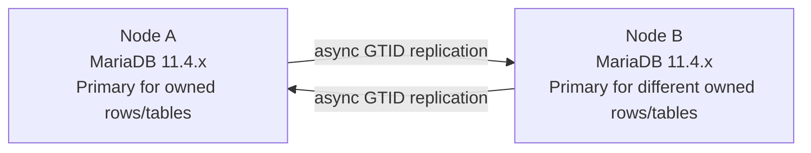

A two-node MariaDB 11.4 master-master setup is an **asynchronous GTID ring**: each node is both a primary and a replica of the other. Both nodes must run the same MariaDB 11.4.x major-minor release and start from one consistent snapshot. Ring replication is not Galera and has no automatic conflict resolution, so production writes need documented row- or table-level single-writer ownership.

This guide uses the historical term *master-master* once for search compatibility. The explanation otherwise uses *primary*, *replica*, Node A, and Node B; MariaDB SQL such as `CHANGE MASTER TO` and status fields such as `Master_Host` retain their official names.

## Scope and safety contract

Use this procedure only when all of these conditions are true:

- Node A and Node B both run MariaDB 11.4.x.
- Application writes can be frozen during bootstrap and verification.
- The nodes can reach each other on the MariaDB port through a protected network path.
- One consistent Node A snapshot will initialize Node B.
- Every active table or row range has one documented writer. The same row or key is never changed concurrently on both nodes.
- DDL and schema changes run during one coordinated maintenance window, on one node at a time, after writes are stopped.

This setup does not provide synchronous commits, automatic failover, or conflict resolution. Use [MariaDB Galera Cluster](https://mariadb.com/docs/galera-cluster/) when the requirement is synchronous multi-primary behavior rather than an asynchronous ring.

## Two-node ring topology



Each node writes its local transactions to the binary log and also logs replicated transactions with `log_slave_updates`. Unique `server_id` values let a returning event be recognized instead of circulating forever. Unique `gtid_domain_id` values distinguish transactions generated by each primary.

## Prerequisites

### Confirm the same MariaDB 11.4.x release

Run this on both nodes:

```sql
SELECT VERSION();
```

Both results must begin with `11.4.`. Mixed minor releases and cross-version migrations are outside this guide's support contract.

Example network values used below:

| Role | Host | Address |
| --- | --- | --- |
| Node A | `db-a.example.net` | `10.0.0.11` |
| Node B | `db-b.example.net` | `10.0.0.12` |

Replace every example hostname, address, user, and secret. Restrict the replication port with a firewall and use TLS when traffic crosses an untrusted network.

### Assign write ownership before enabling the ring

Write down which node owns each table or row range. Even with separate `AUTO_INCREMENT` sequences, two nodes can still update or delete the same row differently. Do not enable application writes until the ownership rules and a single coordinated DDL window are enforced.

## Configure unique node identities

Apply these settings in the MariaDB server option file, such as `/etc/mysql/mariadb.conf.d/50-server.cnf`.

Node A:

```ini
[mariadb]
server_id=11
gtid_domain_id=101
log_bin=mariadb-bin
binlog_format=ROW
log_slave_updates=ON
gtid_strict_mode=ON
auto_increment_increment=2
auto_increment_offset=1
```

Node B:

```ini
[mariadb]
server_id=12
gtid_domain_id=102
log_bin=mariadb-bin
binlog_format=ROW
log_slave_updates=ON
gtid_strict_mode=ON
auto_increment_increment=2
auto_increment_offset=2
```

The increment of `2` gives Node A odd generated IDs and Node B even generated IDs. It reduces `AUTO_INCREMENT` collisions, but it does not resolve conflicting updates, explicit duplicate keys, or divergent DDL.

Do not restart Node B with an empty or unrelated data directory yet. The safe bootstrap order below restores the shared snapshot before the final Node B start.

## Bootstrap both nodes from one snapshot

### 1. Freeze writes and create the replication accounts

Stop application and maintenance writes on both nodes. On canonical Node A, create only the accounts that the two peer addresses need:

```sql
CREATE USER 'repl_ring'@'10.0.0.11' IDENTIFIED BY 'replace-with-a-secret';
CREATE USER 'repl_ring'@'10.0.0.12' IDENTIFIED BY 'replace-with-a-secret';

GRANT REPLICATION SLAVE ON *.* TO 'repl_ring'@'10.0.0.11';
GRANT REPLICATION SLAVE ON *.* TO 'repl_ring'@'10.0.0.12';
```

Create the accounts before the snapshot so the account transactions and grants are present on both nodes after restore. Prefer exact peer addresses over `%`, protect credentials outside shell history, and configure certificate verification when TLS is required.

### 2. Record Node A state and take the backup

With application writes still frozen, record the live GTID set:

```sql
SELECT @@global.gtid_current_pos;
SHOW MASTER STATUS;
```

Take a full physical backup with the MariaDB Backup version compatible with MariaDB 11.4.x:

```bash
sudo mariadb-backup \
  --backup \
  --binlog-info=ON \
  --target-dir=/backup/node-a \
  --user=backup_operator \
  --password
```

Record the generated backup metadata without editing it:

```bash
sudo cat /backup/node-a/mariadb_backup_binlog_info
```

The metadata stores the binary-log coordinates and the `gtid_current_pos` associated with the backup. Keep it together with the earlier SQL output and backup checksum.

Prepare the snapshot:

```bash
sudo mariadb-backup \
  --prepare \
  --target-dir=/backup/node-a
```

### 3. Restore the snapshot on Node B

Stop MariaDB on Node B. Its destination data directory must be empty; preserve any old directory separately instead of overwriting it.

```bash
sudo systemctl stop mariadb
sudo mariadb-backup \
  --copy-back \
  --target-dir=/backup/node-a
sudo chown -R mysql:mysql /var/lib/mysql
```

Apply Node B's unique option-file settings, then restart both nodes:

```bash
sudo systemctl restart mariadb
```

Before any write occurs on Node B, confirm that its new binary log and replica state are empty:

```sql
SELECT
  @@global.gtid_binlog_state,
  @@global.gtid_binlog_pos,
  @@global.gtid_slave_pos;
```

All three values must be empty. MariaDB Backup does not copy binary logs, so this clean state is expected after a fresh restore. If any value is nonempty, stop and rebuild Node B from a fresh snapshot. Do not use `RESET MASTER` to force this check to pass.

Copy the complete GTID set from the recorded `mariadb_backup_binlog_info` into both Node B's binary-log history and replica position. Replace the example with the complete metadata value; do not copy the binlog filename or byte position into these variables.

```sql
SET GLOBAL gtid_binlog_state='101-11-12345';
SET GLOBAL gtid_slave_pos='101-11-12345';

SELECT
  @@global.gtid_binlog_state,
  @@global.gtid_binlog_pos,
  @@global.gtid_slave_pos,
  @@global.gtid_current_pos;
```

MariaDB Backup records a primary's GTID in the backup metadata, but restoring the physical files does not automatically restore the primary's binary-log history or make that GTID Node B's replicated position. `gtid_binlog_state` lets Node B, when it acts as a primary, recognize the snapshot history whose binary-log files were not copied. `gtid_slave_pos` records which snapshot transactions are already present in the restored data. Confirm that no replica connection or thread exists before setting them, and stop if the metadata is missing, malformed, or differs from the position recorded on Node A.

Confirm the effective identities:

```sql
SELECT
  @@global.server_id,
  @@global.gtid_domain_id,
  @@global.log_bin,
  @@global.log_slave_updates,
  @@global.gtid_strict_mode,
  @@global.auto_increment_increment,
  @@global.auto_increment_offset,
  @@global.gtid_current_pos;
```

Node A must report server/domain `11/101` and offset `1`; Node B must report `12/102` and offset `2`.

### 4. Compare data and GTID provenance before connecting

Compare representative row counts, checksums appropriate to the dataset, the backup metadata, `@@global.gtid_slave_pos` on Node B, and `@@global.gtid_current_pos` on both nodes.

MariaDB GTIDs use `domain-server-sequence` components. Parse and compare those components instead of trusting an unexamined string comparison. Before the initial ring connections, verify that:

1. Node A's recorded snapshot position matches the complete GTID set in `mariadb_backup_binlog_info`;
2. Node B's `gtid_binlog_state` and `gtid_slave_pos` contain that same snapshot-derived domain/server/sequence set;
3. both nodes' `gtid_current_pos` contain the same snapshot position and neither node has any post-snapshot local GTID;
4. both nodes contain the same restored data.

The configured `gtid_domain_id` values differ so future local transactions can use domains `101` and `102`; that setting alone does not justify an extra GTID before the ring exists. If the data differs, a snapshot GTID is missing, or either node has any post-snapshot local GTID, stop here. Do not run `CHANGE MASTER TO`, even when the extra transaction is documented. Re-freeze writes and create a fresh snapshot instead.

## Connect both replication directions

`MASTER_USE_GTID=current_pos` is safe here only because writes remain frozen, Node B's `gtid_binlog_state` and `gtid_slave_pos` were initialized from the backup metadata, and the previous step proved that neither node has a post-snapshot local GTID. A local write while replication is stopped changes `gtid_current_pos` to a position the peer may not have; if that happens before both directions are connected, discard this bootstrap attempt and start again from a fresh snapshot.

On Node B, connect to Node A:

```sql
CHANGE MASTER TO
  MASTER_HOST='10.0.0.11',
  MASTER_USER='repl_ring',
  MASTER_PASSWORD='replace-with-a-secret',
  MASTER_PORT=3306,
  MASTER_USE_GTID=current_pos,
  MASTER_CONNECT_RETRY=10;

START REPLICA;
```

On Node A, connect to Node B:

```sql
CHANGE MASTER TO
  MASTER_HOST='10.0.0.12',
  MASTER_USER='repl_ring',
  MASTER_PASSWORD='replace-with-a-secret',
  MASTER_PORT=3306,
  MASTER_USE_GTID=current_pos,
  MASTER_CONNECT_RETRY=10;

START REPLICA;
```

If the deployment requires TLS, add the appropriate `MASTER_SSL`, CA, client certificate, key, and server-certificate verification options instead of sending credentials over an unprotected path.

## Verify both replication links

Keep application writes stopped. Wait for any initial lag to drain, then run on both nodes:

```sql
SHOW REPLICA STATUS\G
```

Use field names rather than fixed column positions. The two sides should meet these conditions:

| Check | Node A expects | Node B expects |
| --- | --- | --- |
| `Master_Host` | `10.0.0.12` | `10.0.0.11` |
| `Using_Gtid` | `Current_Pos` | `Current_Pos` |
| `Slave_IO_Running` | `Yes` | `Yes` |
| `Slave_SQL_Running` | `Yes` | `Yes` |
| `Last_IO_Errno` | `0` | `0` |
| `Last_SQL_Errno` | `0` | `0` |
| lag | drained while writes are stopped | drained while writes are stopped |

`Seconds_Behind_Master` alone is not a sufficient health check. Require both threads to be running, both error numbers to be zero, and the expected opposite host to be connected.

## Run a serialized two-way write test

This is a controlled bootstrap test while application writes are still frozen. It is not permission for concurrent production writes to the same table.

On Node A, create the verification table and wait until it appears on Node B:

```sql
CREATE DATABASE IF NOT EXISTS replication_verify;
CREATE TABLE replication_verify.ring_probe (
  id BIGINT UNSIGNED NOT NULL AUTO_INCREMENT,
  token VARCHAR(80) NOT NULL,
  written_by ENUM('node-a', 'node-b') NOT NULL,
  created_at TIMESTAMP NOT NULL DEFAULT CURRENT_TIMESTAMP,
  PRIMARY KEY (id),
  UNIQUE KEY uq_ring_probe_token (token)
) ENGINE=InnoDB;
```

Insert the Node A token:

```sql
INSERT INTO replication_verify.ring_probe (token, written_by)
VALUES ('node-a-20260726', 'node-a');

SELECT LAST_INSERT_ID() AS node_a_id;
```

The ID must be odd. On Node B, wait until that exact token and odd ID are visible:

```sql
SELECT id, token, written_by
FROM replication_verify.ring_probe
WHERE token = 'node-a-20260726';
```

Only after the Node A row is confirmed, insert on Node B:

```sql
INSERT INTO replication_verify.ring_probe (token, written_by)
VALUES ('node-b-20260726', 'node-b');

SELECT LAST_INSERT_ID() AS node_b_id;
```

The Node B ID must be even and different from the Node A ID. Finally, run this on both nodes:

```sql
SELECT id, token, written_by
FROM replication_verify.ring_probe
WHERE token IN ('node-a-20260726', 'node-b-20260726')
ORDER BY id;
```

Pass only when both nodes show the same two-row set, the tokens are unique, the IDs differ, Node A's ID is odd, and Node B's ID is even. Resume application writes only after this test and another clean `SHOW REPLICA STATUS\G` check.

## Stop on errors or divergence

Stop new writes immediately when any of these conditions appears:

- `Slave_IO_Running` or `Slave_SQL_Running` is not `Yes`;
- `Last_IO_Errno` or `Last_SQL_Errno` is nonzero;
- duplicate-key or row-conflict errors occur;
- data or GTID provenance differs from the recorded snapshot;
- an application violates row/table ownership;
- replication lag does not drain while writes are frozen.

Capture `SHOW REPLICA STATUS\G`, the relevant MariaDB error log, both GTID sets, the snapshot metadata, and the affected rows. Diagnose the initial dataset, GTID relationship, network/TLS settings, account host restrictions, and ownership rules before changing replication state. Do not skip an event merely to make the threads appear healthy; an unexplained skipped transaction can preserve divergence.

## Operating limits

- Ring replication is asynchronous. A disconnected node can accept local writes, which increases conflict risk when the link returns.
- MariaDB ring replication does not resolve conflicting inserts, updates, deletes, or DDL.
- `AUTO_INCREMENT` offsets protect generated keys only; they do not protect explicit keys or existing rows.
- Run DDL from one coordinated node during a write freeze and wait for it to replicate before continuing.
- Backups, restore drills, monitoring, routing, and failover policy remain separate operational responsibilities.
- Validate this procedure on staging nodes before production use.

## Official MariaDB references

- [Multi-Master Ring Replication](https://mariadb.com/docs/server/ha-and-performance/standard-replication/multi-master-ring-replication)
- [Setting Up Replication](https://mariadb.com/docs/server/ha-and-performance/standard-replication/setting-up-replication)
- [Global Transaction ID](https://mariadb.com/docs/server/ha-and-performance/standard-replication/gtid)
- [AUTO_INCREMENT](https://mariadb.com/docs/server/reference/data-types/auto_increment)
- [SHOW REPLICA STATUS](https://mariadb.com/docs/server/reference/sql-statements/administrative-sql-statements/show/show-replica-status)
- [Files Created by mariadb-backup](https://mariadb.com/docs/server/server-usage/backup-and-restore/mariadb-backup/files-created-by-mariadb-backup)
- [Files Backed Up by mariadb-backup](https://mariadb.com/docs/server/server-usage/backup-and-restore/mariadb-backup/files-backed-up-by-mariadb-backup)
- [Setting up a Replica with mariadb-backup](https://mariadb.com/docs/server/server-usage/backup-and-restore/mariadb-backup/setting-up-a-replica-with-mariadb-backup)

## Related reading

- [MariaDB 11 replication setup in Korean]()
